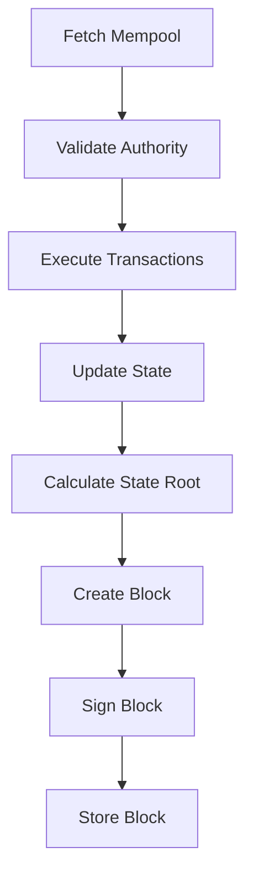

The `block` command handles block production and querying. It allows authorities to produce new blocks and anyone to browse the blockchain.

## Subcommands

- `produce` - Produce a new block (authority only)
- `list` - List recent blocks
- `info` - Show detailed block information

## Produce Block

Produce a new block containing pending transactions from the mempool.

```bash
minichain block produce --authority <NAME>
```

### Basic Usage

```bash
cargo run --release -- block produce --authority authority_0
```

**Output:**
```
Producing new block...

  Authority: 0xf4a5e8c2b9d7f3a1e6b8c4d9f2a5e8c1
  Current Height: 0

✓  Block produced
    Hash:   0x7d9f2a5c8e4b1f3a6c9e2d5f8a1c4e7b...
    Height: 1
    Txs:    2
```

### Authority Selection

```bash
--authority <NAME>
```

Keypair name of the authority (without `.json` extension).

**Example:**
```bash
--authority authority_0
--authority authority_1
```

The authority must be registered during blockchain initialization.

### Authority Validation

Minichain uses Proof of Authority (PoA) consensus with round-robin scheduling:

```
authority_index = block_height % authority_count
```

**Example with 3 authorities:**

| Block Height | Required Authority |
|--------------|-----------------|
| 0 | authority_0 |
| 1 | authority_1 |
| 2 | authority_2 |
| 3 | authority_0 |
| 4 | authority_1 |

If the wrong authority tries to produce a block:

```bash
$ minichain block produce --authority authority_1
Error: Address 0x3d8e9f2a6b4c1e7f8a2c5d9e1f4b7a3c is not an authority.
Authorities: ["0xf4a5e8c2b9d7f3a1e6b8c4d9f2a5e8c1", ...]
```

<Info>
See the [Consensus](/core-concepts/blocks-and-consensus) documentation for more details on PoA validation.
</Info>

### Block Production Process

When producing a block:

1. **Fetch pending transactions** from mempool
2. **Validate authority** - Verify correct authority for current height
3. **Execute transactions** - Run each transaction in the VM
4. **Update state** - Apply state changes to account balances, nonces, storage
5. **Calculate state root** - Generate merkle root of state
6. **Create block** - Assemble header and transaction list
7. **Sign block** - Authority signs with Ed25519
8. **Store block** - Persist to database



### Empty Blocks

You can produce blocks with no transactions:

```bash
minichain block produce --authority authority_0
```

**Output:**
```
✓  Block produced
    Hash:   0x7d9f2a5c8e4b1f3a6c9e2d5f8a1c4e7b...
    Height: 1
    Txs:    0
```

Empty blocks advance the chain height and update the timestamp, but don't modify account state.

## List Blocks

Display recent blocks in the chain.

```bash
minichain block list [OPTIONS]
```

### Basic Usage

```bash
cargo run --release -- block list
```

**Output:**
```
Recent Blocks:

  #4 0x9f3a6c2e8d5b... (2 txs)
  #3 0x7d4b8f2a5c9e... (1 txs)
  #2 0x5c1e9f3a6d8b... (3 txs)
  #1 0x3a8d5f2c9e1b... (2 txs)
  #0 0x1f7c4e9a2d6b... (0 txs)
```

### Options

#### Count

```bash
--count <NUMBER>
```

Number of blocks to display. Defaults to `10`.

**Example:**
```bash
minichain block list --count 20
```

Shows the most recent N blocks, in reverse chronological order (newest first).

## Block Information

Show detailed information about a specific block.

```bash
minichain block info <BLOCK_ID>
```

### Query by Height

```bash
cargo run --release -- block info 5
```

**Output:**
```
Block Information:

  Height:       5
  Hash:         0x7d9f2a5c8e4b1f3a6c9e2d5f8a1c4e7b...
  Parent Hash:  0x5c1e9f3a6d8b2f4a7c9e2d5f8a1c4e7b...
  State Root:   0x3a8d5f2c9e1b4f7a6c9e2d5f8a1c4e7b...
  Timestamp:    1709740123
  Transactions: 2

Transactions:

  1. 0x9f3a6c2e8d5b...
  2. 0x7d4b8f2a5c9e...
```

### Query by Hash

```bash
minichain block info 0x7d9f2a5c8e4b1f3a6c9e2d5f8a1c4e7b...
```

Returns the same detailed output. The CLI automatically detects whether you provided a height (number) or hash (hex string).

### Block Header Fields

- **Height:** Block number (genesis = 0)
- **Hash:** Blake3 hash of the block header
- **Parent Hash:** Hash of the previous block
- **State Root:** Merkle root of the account state
- **Timestamp:** Unix timestamp when block was produced
- **Transactions:** Number of transactions in the block

## Complete Workflow

Here's a typical block production workflow:

```bash
# 1. Initialize chain
minichain init --authorities 1

# 2. Check initial state (genesis block only)
minichain block list
# Output:
#   Recent Blocks:
#   #0 0x1f7c4e9a2d6b... (0 txs)

# 3. Create accounts and fund them
minichain account new --name alice
minichain account mint --from authority_0 --to <ALICE> --amount 50000

# 4. Submit transactions
minichain tx send --from alice --to <BOB> --amount 100
minichain tx send --from alice --to <CHARLIE> --amount 200

# 5. Produce block to execute transactions
minichain block produce --authority authority_0
# Output:
#   ✓ Block produced
#     Height: 1
#     Txs: 2

# 6. View updated chain
minichain block list
# Output:
#   Recent Blocks:
#   #1 0x7d9f2a5c8e4b... (2 txs)
#   #0 0x1f7c4e9a2d6b... (0 txs)

# 7. Examine the new block
minichain block info 1
# Output:
#   Height: 1
#   Transactions: 2
#   1. 0x9f3a6c2e8d5b...
#   2. 0x7d4b8f2a5c9e...
```

## Multiple Authorities

With multiple authorities, block production rotates:

```bash
# Initialize with 3 authorities
minichain init --authorities 3

# Block 1: authority_1 must produce
minichain block produce --authority authority_1

# Block 2: authority_2 must produce
minichain block produce --authority authority_2

# Block 3: authority_0 must produce (wraps around)
minichain block produce --authority authority_0

# Block 4: authority_1 again
minichain block produce --authority authority_1
```

Trying to use the wrong authority fails:

```bash
# Current height is 1, so authority_1 should produce
minichain block produce --authority authority_0
# Error: Wrong authority for height 1
```

## Block Validation

Each block is validated for:

1. **Authority signature** - Block signed by correct authority keypair
2. **Authority schedule** - Authority matches `height % authority_count`
3. **Timestamp** - Not too far in future (allows small clock drift)
4. **Parent hash** - Links to previous block
5. **Transaction validity** - All transactions pass validation
6. **State root** - Matches computed state after execution

<Note>
In a single-node setup, you're unlikely to hit validation errors. These checks become critical in multi-node deployments.
</Note>

## Block Structure

A block contains:

```rust
Block {
    header: BlockHeader {
        height: u64,
        prev_hash: Hash,
        state_root: Hash,
        timestamp: u64,
        authority: Address,
    },
    transactions: Vec<Transaction>,
    signature: Signature,
}
```

The block hash is computed from the header:

```rust
block_hash = blake3(header)
```

## Common Errors

### Authority Not Found

```bash
Error: Keypair file not found: data/keys/authority_0.json. 
Use 'minichain account new' to create one.
```

**Solution:** Ensure you ran `minichain init` to generate authority keypairs.

### Wrong Authority

```bash
Error: Address 0x3d8e9f2a... is not an authority.
Authorities: ["0xf4a5e8c2...", ...]
```

**Solution:** Use an authority address from the list in config.json.

### Chain Not Initialized

```bash
Error: Failed to open storage. Did you run 'minichain init'?
```

**Solution:** Run `minichain init` first.

### Block Not Found

```bash
Error: Block not found
```

**Solution:** Check the block height/hash is correct with `minichain block list`.

## Next Steps

<CardGroup cols={2}>
  <Card title="Deploy Contracts" icon="rocket" href="/cli/contract-operations">
    Deploy smart contracts in blocks
  </Card>
  <Card title="Explore Chain" icon="magnifying-glass" href="/cli/exploring">
    Query blockchain state and history
  </Card>
</CardGroup>
