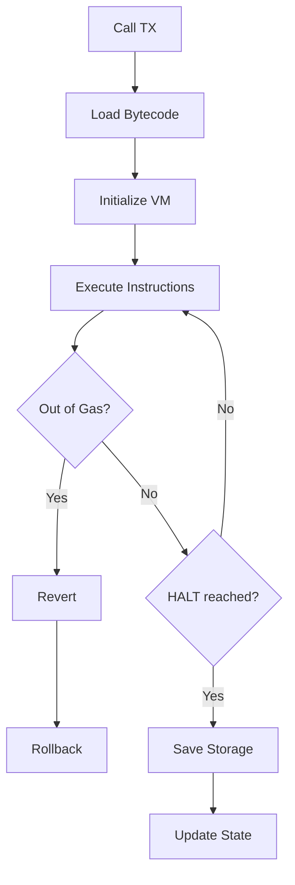

Minichain supports deploying and executing smart contracts written in the custom assembly language. The `deploy` and `call` commands handle contract operations.

## Deploy Contract

Deploy a smart contract from assembly source code.

```bash
minichain deploy --from <NAME> --source <FILE> --gas-limit <LIMIT> [OPTIONS]
```

### Basic Usage

Create a simple counter contract (`counter.asm`):

```asm
.entry main

main:
    LOADI R0, 0          ; storage slot 0 = counter
    SLOAD R1, R0         ; load current value
    LOADI R2, 1
    ADD R1, R1, R2       ; increment
    SSTORE R0, R1        ; save back
    HALT
```

Deploy it:

```bash
cargo run --release -- deploy \
  --from alice \
  --source counter.asm \
  --gas-limit 80000
```

**Output:**
```
Deploying contract...

  Compiling: counter.asm
✓  Compiled to 28 bytes

  Deployer:  0x3f8c2a6e9b5d1f4a7c9e2b8d5f3a1c6e
  Nonce:     0
  Balance:   50000

✓  Transaction created
    Hash: 0x7d9f2a5c8e4b1f3a6c9e2d5f8a1c4e7b...

✓  Contract deployment submitted

  Contract Address: 0xa7b3c9e5d1f4a8c2b6e9d2f5a8c1e4b7

Transaction will be included in the next block.
Use minichain block produce to produce a block.
```

### Options

#### From Account

```bash
--from <NAME>
```

Keypair name of the deployer (without `.json` extension).

**Example:**
```bash
--from alice
--from bob
```

#### Source File

```bash
--source <FILE>
```

Path to the assembly source file.

**Example:**
```bash
--source counter.asm
--source contracts/token.asm
--source ../examples/storage.asm
```

The file must contain valid Minichain assembly. See the [Assembly Language](/smart-contracts/assembly-language) documentation.

#### Gas Limit

```bash
--gas-limit <LIMIT>
```

Maximum gas the deployer is willing to spend. This is a safety cap—the actual gas used is calculated automatically.

**Gas calculation:**
```
gas_required = 21000 + (bytecode.len() * 200)
```

**Example:**
```bash
--gas-limit 80000
```

If the gas limit is too low:

```bash
Error: Gas limit too low: required 26600, got 20000
```

<Info>
The actual gas consumed is `21000 + (bytecode_bytes * 200)`. Set your limit higher than this to ensure deployment succeeds.
</Info>

#### Gas Price

```bash
--gas-price <PRICE>
```

Gas price per unit. Defaults to `1`.

**Example:**
```bash
--gas-price 2
```

Total cost: `gas_required * gas_price`

### Contract Address Calculation

The contract address is deterministically computed from:

```rust
contract_address = blake3(deployer_address || deployer_nonce)
```

This ensures:
- Each deployment gets a unique address
- The address is predictable before deployment
- No address collisions

<Note>
The CLI displays the contract address before the transaction is included in a block. You can use this address immediately in subsequent `call` commands (though they won't execute until the deployment is finalized).
</Note>

### Compilation

The `deploy` command automatically compiles assembly to bytecode:

1. **Lexer** - Tokenize assembly source
2. **Parser** - Build abstract syntax tree
3. **Assembler** - Generate VM bytecode
4. **Validation** - Verify bytecode is valid

**Example compilation:**

```asm
.entry main
main:
    LOADI R0, 42
    HALT
```

↓

```
Bytecode: [0x01, 0x00, 0x00, 0x2A, 0x00, ...]
Size: 28 bytes
```

See the [Assembler](/smart-contracts/assembly-language) documentation for the full assembly language specification.

## Call Contract

Execute a deployed contract's code.

```bash
minichain call --from <NAME> --to <ADDRESS> [OPTIONS]
```

### Basic Usage

```bash
cargo run --release -- call \
  --from alice \
  --to 0xa7b3c9e5d1f4a8c2b6e9d2f5a8c1e4b7
```

**Output:**
```
Calling contract...

  Caller:    0x3f8c2a6e9b5d1f4a7c9e2b8d5f3a1c6e
  Contract:  0xa7b3c9e5d1f4a8c2b6e9d2f5a8c1e4b7
  Amount:    0
  Data:      0 bytes
  Nonce:     1
  Balance:   28900

✓  Transaction created
    Hash: 0x5c1e9f3a6d8b2f4a7c9e2d5f8a1c4e7b...

✓  Contract call submitted

Transaction will be included in the next block.
Use minichain block produce to produce a block.
```

### Options

#### From Account

```bash
--from <NAME>
```

Keypair name of the caller.

#### To Address

```bash
--to <ADDRESS>
```

Contract address in hexadecimal format.

**Example:**
```bash
--to 0xa7b3c9e5d1f4a8c2b6e9d2f5a8c1e4b7
```

The CLI verifies this is a contract address (has code) before submitting.

#### Call Data

```bash
--data <HEX>
```

Hexadecimal calldata passed to the contract. Defaults to empty.

**Example:**
```bash
--data 01020304
--data "a7b3c9e5"
```

The contract can read this data using `LOAD64` and `STORE64` memory operations.

<Info>
Currently, Minichain doesn't have a standardized ABI. Calldata interpretation depends on your contract's logic.
</Info>

#### Amount

```bash
--amount <AMOUNT>
```

Tokens to send with the call. Defaults to `0`.

**Example:**
```bash
--amount 100
```

The tokens are transferred from caller to contract before execution. The contract can query its balance using the state.

#### Gas Price

```bash
--gas-price <PRICE>
```

Gas price per unit. Defaults to `1`.

### Gas Estimation

Call gas is estimated as:

```
gas_limit = 21000 + (calldata.len() * 68) + 2100
```

- **21,000:** Base transaction cost
- **68 per byte:** Calldata cost
- **2,100:** CALL opcode overhead

Actual execution may use more or less depending on the contract code:

- **Arithmetic ops:** 2-4 gas each
- **Memory ops:** 3 gas each
- **Storage reads:** 100 gas each
- **Storage writes:** 5,000-20,000 gas each

See the [Gas Metering](/vm/gas-metering) documentation for complete details.

## Complete Example

Deploy and call a counter contract:

```bash
# 1. Create counter contract
cat > counter.asm << 'EOF'
.entry main

main:
    LOADI R0, 0          ; storage slot 0
    SLOAD R1, R0         ; load counter
    LOADI R2, 1
    ADD R1, R1, R2       ; increment
    SSTORE R0, R1        ; save
    HALT
EOF

# 2. Deploy contract
minichain deploy \
  --from alice \
  --source counter.asm \
  --gas-limit 80000
# Output:
#   ✓ Contract deployment submitted
#   Contract Address: 0xa7b3c9e5d1f4a8c2...

# 3. Produce block to finalize deployment
minichain block produce --authority authority_0

# 4. Verify contract exists
minichain account info 0xa7b3c9e5d1f4a8c2...
# Output:
#   Is Contract: Yes
#   Code Hash: 0x8f2a5c9e1d4b7f3a...

# 5. Call contract (increments counter to 1)
minichain call --from alice --to 0xa7b3c9e5d1f4a8c2...
minichain block produce --authority authority_0

# 6. Call again (increments to 2)
minichain call --from alice --to 0xa7b3c9e5d1f4a8c2...
minichain block produce --authority authority_0

# 7. Call a third time (increments to 3)
minichain call --from bob --to 0xa7b3c9e5d1f4a8c2...
minichain block produce --authority authority_0

# The contract's storage slot 0 now holds value 3
```

## Contract Execution

When a call transaction is included in a block:

1. **Load contract bytecode** from state
2. **Initialize VM** with gas limit
3. **Load calldata** into memory
4. **Execute bytecode** instruction by instruction
5. **Update storage** for SSTORE operations
6. **Return result** (VM halts successfully or runs out of gas)
7. **Update state** - Save storage changes, increment nonce, deduct gas



<Warning>
If a contract runs out of gas, all state changes are reverted, but gas is still consumed. Set sufficient gas limits.
</Warning>

## Contract Storage

Contracts have isolated storage:

- **Key-value store:** `u64 -> u64` mappings
- **Persistent:** Storage survives across calls
- **Per-contract:** Each contract has its own storage namespace

**Example:**

```asm
; Store value 42 at slot 0
LOADI R0, 0
LOADI R1, 42
SSTORE R0, R1

; Load value from slot 0
LOADI R0, 0
SLOAD R2, R0
; R2 now contains 42
```

See the [Virtual Machine](/vm/overview) documentation for complete instruction details.

## Example Contracts

### Simple Storage

```asm
.entry main

main:
    ; Write 123 to slot 0
    LOADI R0, 0
    LOADI R1, 123
    SSTORE R0, R1
    HALT
```

### Accumulator

```asm
.entry main

main:
    ; Load current value from slot 0
    LOADI R0, 0
    SLOAD R1, R0
    
    ; Add 5
    LOADI R2, 5
    ADD R1, R1, R2
    
    ; Store result
    SSTORE R0, R1
    HALT
```

### Conditional Logic

```asm
.entry main

main:
    LOADI R0, 0
    SLOAD R1, R0        ; load counter
    
    LOADI R2, 10
    BLT R1, R2, increment
    
    ; Counter >= 10, reset to 0
    LOADI R1, 0
    JMP store
    
increment:
    LOADI R2, 1
    ADD R1, R1, R2
    
store:
    SSTORE R0, R1
    HALT
```

## Common Errors

### Contract Not Found

```bash
Error: Address 0xABC... is not a contract
```

**Solution:** Verify the address is correct and the deployment was finalized in a block.

### Compilation Failed

```bash
Error: Failed to compile assembly code
Parse error at line 5: unexpected token
```

**Solution:** Fix syntax errors in your assembly file.

### Insufficient Balance

```bash
Error: Insufficient balance: have 10000, need 26600 (estimated)
```

**Solution:** Mint more tokens to the deployer account.

### Gas Limit Too Low

```bash
Error: Gas limit too low: required 26600, got 20000
```

**Solution:** Increase `--gas-limit` to at least the required amount.

## Next Steps

<CardGroup cols={2}>
  <Card title="Assembly Language" icon="code" href="/smart-contracts/assembly-language">
    Learn the full assembly syntax
  </Card>
  <Card title="Virtual Machine" icon="microchip" href="/vm/overview">
    Understand VM execution model
  </Card>
  <Card title="Example Contracts" icon="file-code" href="/smart-contracts/examples">
    Explore sample contracts
  </Card>
  <Card title="Gas Optimization" icon="gauge" href="/vm/gas-metering">
    Optimize gas usage
  </Card>
</CardGroup>
