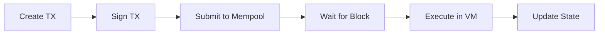

The `tx` command handles transaction operations. Currently, it supports transferring tokens between accounts.

## Send Transfer

Transfer tokens from one account to another.

```bash
minichain tx send --from <NAME> --to <ADDRESS> --amount <AMOUNT> [OPTIONS]
```

## Basic Usage

```bash
cargo run --release -- tx send \
  --from alice \
  --to 0x8d2c5e9f1a4b7c3d6e9f2a5c8b1d4e7f \
  --amount 100
```

**Output:**
```
Sending transfer transaction...

  From:     0x3f8c2a6e9b5d1f4a7c9e2b8d5f3a1c6e
  To:       0x8d2c5e9f1a4b7c3d6e9f2a5c8b1d4e7f
  Amount:   100
  Nonce:    0
  Balance:  50000

✓  Transaction created
    Hash: 0x7d9f2a5c8e4b1f3a6c9e2d5f8a1c4e7b...

✓  Transaction submitted to mempool

Transaction will be included in the next block.
Use minichain block produce to produce a block.
```

## Options

### From Account

```bash
--from <NAME>
```

Keypair name of the sender (without `.json` extension).

**Example:**
```bash
--from alice
--from bob
--from authority_0
```

The CLI loads the private key from `data/keys/<name>.json` to sign the transaction.

### To Address

```bash
--to <ADDRESS>
```

Recipient address in hexadecimal format with `0x` prefix.

**Example:**
```bash
--to 0x8d2c5e9f1a4b7c3d6e9f2a5c8b1d4e7f
```

### Amount

```bash
--amount <AMOUNT>
```

Number of tokens to transfer.

**Example:**
```bash
--amount 100
--amount 1000000
```

### Gas Price

```bash
--gas-price <PRICE>
```

Gas price per unit. Defaults to `1`.

**Example:**
```bash
--gas-price 2
```

**Total gas cost:**
```
gas_cost = 21000 * gas_price
```

For the default gas price of 1, transfer transactions cost 21,000 tokens.

<Info>
Gas pricing affects transaction priority. Higher gas prices may be prioritized in the mempool (though currently mempool ordering is first-in-first-out).
</Info>

### Data Directory

```bash
--data-dir <PATH>
```

Specifies blockchain data location. Defaults to `./data`.

## Transaction Flow

When you send a transaction:

1. **Load keypair** - Private key loaded from `data/keys/<name>.json`
2. **Get nonce** - Current nonce fetched from account state
3. **Check balance** - Verifies sufficient funds for amount + gas
4. **Create transaction** - Transaction object constructed with all parameters
5. **Sign transaction** - Ed25519 signature generated using private key
6. **Submit to mempool** - Transaction added to pending transaction pool
7. **Wait for block** - Authority must produce a block to execute the transaction



## Transaction Anatomy

A transfer transaction contains:

```rust
Transaction {
    from: Address,        // Sender address
    to: Some(Address),    // Recipient address
    data: Vec::new(),     // Empty for transfers
    amount: u64,          // Token amount
    nonce: u64,          // Sender's nonce
    gas_limit: 21000,    // Base transaction cost
    gas_price: u64,      // Gas price per unit
    signature: Signature, // Ed25519 signature
}
```

## Nonce Management

Each account tracks a nonce (number used once) to prevent replay attacks:

- **First transaction:** nonce = 0
- **Second transaction:** nonce = 1
- **Third transaction:** nonce = 2
- ...

The CLI automatically fetches the current nonce from account state when creating transactions.

<Warning>
If you manually create transactions, you must use sequential nonces. Transactions with incorrect nonces will be rejected.
</Warning>

## Gas Costs

Transfer transactions have a fixed gas cost:

| Operation | Gas Cost |
|-----------|----------|
| Base transaction | 21,000 |

**Example calculation:**

```bash
# Transfer 100 tokens with gas_price = 1
Amount:    100
Gas cost:  21,000 * 1 = 21,000
Total:     21,100 tokens deducted from sender
Received:  100 tokens added to recipient
```

<Note>
The sender pays the gas cost, not the recipient. The recipient receives exactly the specified amount.
</Note>

## Balance Verification

Before submitting, the CLI checks the sender has sufficient balance:

```bash
$ minichain tx send --from alice --to 0xBOB... --amount 1000000
Error: Insufficient balance: have 50000, need 1021000 
(amount 1000000 + gas 21000)
```

The sender must have:
```
balance >= amount + (gas_limit * gas_price)
```

## Complete Example

Here's a full transfer workflow:

```bash
# 1. Check Alice's initial balance
minichain account balance 0x3f8c2a6e9b5d1f4a...
# Output: Balance: 50000

# 2. Check Bob's initial balance
minichain account balance 0x8d2c5e9f1a4b7c3d...
# Output: Balance: 0

# 3. Send 100 tokens from Alice to Bob
minichain tx send \
  --from alice \
  --to 0x8d2c5e9f1a4b7c3d... \
  --amount 100
# Output:
#   ✓ Transaction submitted to mempool

# 4. Produce a block to execute the transaction
minichain block produce --authority authority_0
# Output:
#   ✓ Block produced
#     Txs: 1

# 5. Verify Alice's new balance (50000 - 100 - 21000 = 28900)
minichain account balance 0x3f8c2a6e9b5d1f4a...
# Output: Balance: 28900

# 6. Verify Bob's new balance (0 + 100 = 100)
minichain account balance 0x8d2c5e9f1a4b7c3d...
# Output: Balance: 100

# 7. Check Alice's nonce incremented
minichain account info 0x3f8c2a6e9b5d1f4a...
# Output:
#   Balance: 28900
#   Nonce: 1
```

## Transaction Finality

Transactions are **immediately final** once included in a block:

1. ✓ Single-node blockchain (no chain reorganizations)
2. ✓ PoA consensus with deterministic authority selection
3. ✓ Blocks cannot be reverted or replaced

Once you see "Block produced", the transaction is permanently recorded.

## Multiple Transactions

You can submit multiple transactions to the mempool before producing a block:

```bash
# Submit 3 transactions
minichain tx send --from alice --to 0xBOB... --amount 50
minichain tx send --from alice --to 0xCHARLIE... --amount 75
minichain tx send --from bob --to 0xALICE... --amount 25

# Produce one block to execute all 3
minichain block produce --authority authority_0
# Output:
#   ✓ Block produced
#     Txs: 3
```

<Info>
Transactions from the same sender must maintain sequential nonces. The CLI automatically handles this by fetching the latest nonce before each transaction.
</Info>

## Common Errors

### Insufficient Balance

```bash
Error: Insufficient balance: have 50000, need 1021000 
(amount 1000000 + gas 21000)
```

**Solution:** Reduce the amount or mint more tokens to the sender.

### Keypair Not Found

```bash
Error: Keypair file not found: data/keys/alice.json. 
Use 'minichain account new' to create one.
```

**Solution:** Create the account first with `minichain account new --name alice`.

### Invalid Address

```bash
Error: Invalid recipient address: 0xinvalid
```

**Solution:** Use a valid hex address with correct length (32 bytes).

## Next Steps

<CardGroup cols={2}>
  <Card title="Produce Blocks" icon="cubes" href="/cli/block-production">
    Learn how to include transactions in blocks
  </Card>
  <Card title="Deploy Contracts" icon="rocket" href="/cli/contract-operations">
    Deploy smart contracts instead of simple transfers
  </Card>
</CardGroup>
