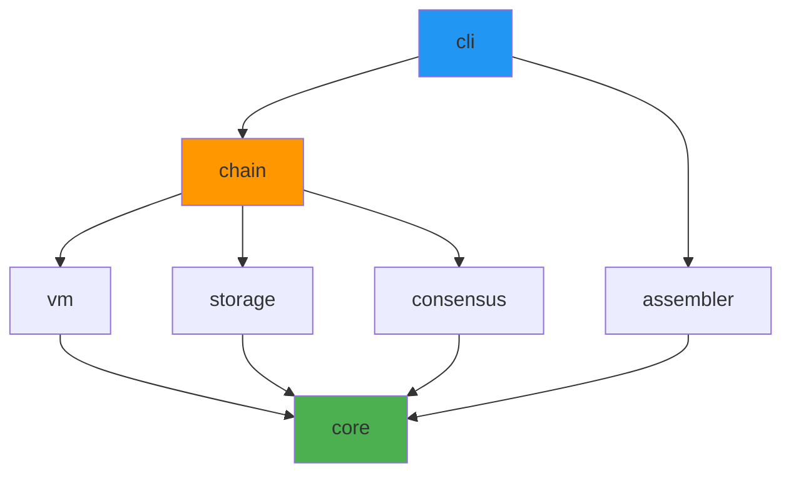
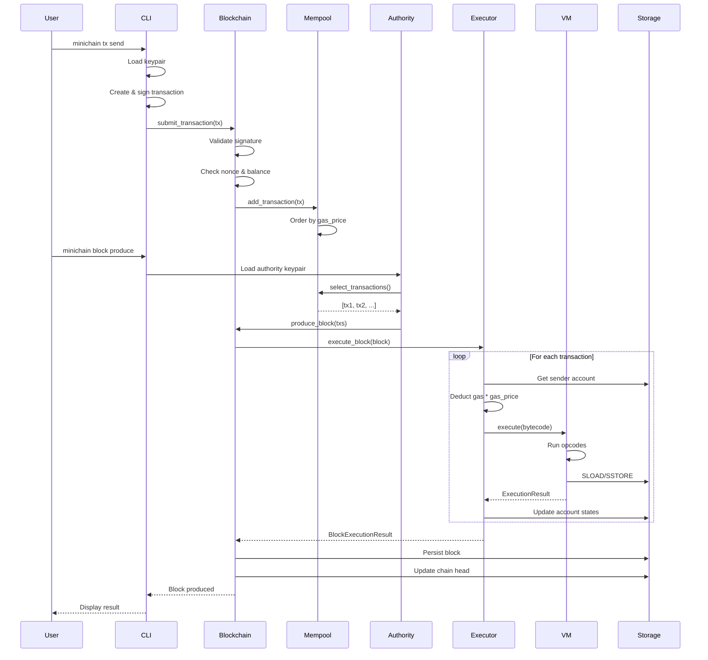

Minichain is built with a clean, modular architecture consisting of 7 Rust crates. Each crate has a single, well-defined responsibility, making the codebase easy to understand and extend.

## The 7 Crates

Minichain's architecture follows a layered design where higher-level crates depend on lower-level ones:



### 1. Core (`minichain-core`)

The foundation of the entire blockchain. Provides primitive types used throughout the system.

**Key Components:**
- **Cryptography**: Blake3 hashing, Ed25519 signatures, 20-byte addresses
- **Accounts**: Balance, nonce, code hash, storage root
- **Transactions**: Transfer, deploy, and call transaction types
- **Blocks**: Block headers and full blocks with merkle roots
- **Merkle Trees**: Efficient state verification

**Core Types:**

```rust
pub struct Account {
    pub nonce: u64,              // Transaction count
    pub balance: u64,            // Native token balance
    pub code_hash: Option<Hash>, // Contract bytecode hash (None for EOAs)
    pub storage_root: Hash,      // Root of account's storage trie
}

pub struct Transaction {
    pub nonce: u64,
    pub from: Address,
    pub to: Option<Address>,     // None for contract deployment
    pub value: u64,
    pub data: Vec<u8>,
    pub gas_limit: u64,
    pub gas_price: u64,
    pub signature: Signature,
}

pub struct BlockHeader {
    pub height: u64,
    pub timestamp: u64,
    pub prev_hash: Hash,
    pub merkle_root: Hash,       // Merkle root of transactions
    pub state_root: Hash,        // Root of world state
    pub author: Address,         // PoA authority
    pub difficulty: u64,         // Always 1 for PoA
    pub nonce: u64,
}
```

<Tip>
  The `core` crate has **zero blockchain-specific dependencies** — it only uses cryptography and serialization libraries. This makes it highly portable and testable.
</Tip>

### 2. Storage (`minichain-storage`)

Persistent state layer built on [sled](https://github.com/spacejam/sled), an embedded key-value database.

**Responsibilities:**
- Account state (balances, nonces, contract code)
- Block storage (by hash and height)
- Contract storage (SLOAD/SSTORE operations)
- State root computation

**Architecture:**

```text
┌─────────────────────────────────────────────────────────┐
│                    Application Layer                     │
│            (Chain, VM, Transaction Execution)            │
└────────────────────────┬────────────────────────────────┘
                         │
┌────────────────────────▼────────────────────────────────┐
│                   Storage Layer                          │
│  ┌─────────────┐  ┌─────────────┐  ┌─────────────────┐  │
│  │ StateManager│  │ ChainStore  │  │ Storage (DB)    │  │
│  │  - Accounts │  │  - Blocks   │  │  - sled wrapper │  │
│  │  - Balances │  │  - Height   │  │  - serialization│  │
│  │  - Contract │  │  - Genesis  │  │  - key helpers  │  │
│  │    Storage  │  │             │  │                 │  │
│  └─────────────┘  └─────────────┘  └─────────────────┘  │
└────────────────────────┬────────────────────────────────┘
                         │
┌────────────────────────▼────────────────────────────────┐
│                    sled Database                         │
│              (Embedded Key-Value Store)                  │
└─────────────────────────────────────────────────────────┘
```

### 3. VM (`minichain-vm`)

Register-based virtual machine with gas metering. Executes contract bytecode.

**Features:**
- 16 general-purpose registers (R0-R15)
- 40+ opcodes (arithmetic, logic, memory, storage, control flow)
- Separate RAM (memory) and disk (storage) operations
- Gas metering on every operation
- Execution tracing for debugging

**Key Modules:**
- `executor.rs`: Main VM execution loop
- `opcodes.rs`: Opcode definitions and decoding
- `gas.rs`: Gas costs and metering
- `memory.rs`: Register and memory management

### 4. Assembler (`minichain-assembler`)

Compiles human-readable assembly language into VM bytecode.

**Features:**
- Labels and jump instructions
- Entry point declarations (`.entry`)
- Immediate values and register operations
- Error reporting with line numbers

**Example:**
```asm
.entry main

main:
    LOADI R0, 0          ; storage slot 0
    SLOAD R1, R0         ; load counter
    ADDI R1, R1, 1       ; increment
    SSTORE R0, R1        ; save back
    HALT
```

### 5. Consensus (`minichain-consensus`)

Proof of Authority (PoA) consensus implementation.

**Components:**
- **PoAConfig**: Authority list and block time settings
- **Authority**: Round-robin block production scheduling
- **BlockProposer**: Creates and signs blocks
- **BlockValidator**: Validates block structure and signatures
- **TransactionValidator**: Validates transaction signatures and nonces

**Round-Robin Scheduling:**
```rust
// Authority at height H = authorities[H % authority_count]
pub fn authority_at_height(&self, height: u64) -> Result<Address> {
    let index = (height as usize) % self.authorities.len();
    Ok(self.authorities[index])
}
```

### 6. Chain (`minichain-chain`)

Orchestrates all components into a functional blockchain.

**Key Components:**
- **Blockchain**: Main orchestrator, manages state and blocks
- **Mempool**: Transaction pool with gas-price ordering
- **Executor**: Executes blocks and transactions
- **BlockchainConfig**: Configuration and authority management

**Responsibilities:**
- Transaction submission and validation
- Block production and execution
- State management and persistence
- Gas tracking and refunds

### 7. CLI (`minichain-cli`)

Command-line interface for interacting with the blockchain.

**Commands:**
- `init`: Initialize new blockchain
- `account`: Manage accounts and balances
- `tx`: Submit transactions
- `block`: Produce and query blocks
- `deploy`: Deploy smart contracts
- `call`: Call contract functions

## Transaction Flow

Let's trace a complete transaction through the system:



### Step-by-Step Breakdown

#### 1. Transaction Creation (CLI)

```rust
// User signs transaction with their keypair
let mut tx = Transaction::transfer(
    from_address,
    to_address,
    amount,
    nonce,
    gas_price,
);
tx.sign(&keypair);
```

#### 2. Transaction Validation (Blockchain)

```rust
// Verify signature
tx.verify(&sender_public_key)?;

// Check nonce matches account
if tx.nonce != account.nonce {
    return Err(ValidationError::InvalidNonce);
}

// Check sufficient balance for value + gas
if account.balance < tx.max_cost() {
    return Err(ValidationError::InsufficientBalance);
}
```

#### 3. Mempool Ordering (Mempool)

```rust
// Transactions ordered by gas_price (highest first)
transactions.sort_by(|a, b| b.gas_price.cmp(&a.gas_price));
```

#### 4. Block Production (Authority)

```rust
// Check if it's our turn
let expected = config.authority_at_height(height)?;
if expected != self.address() {
    return Err(ConsensusError::NotTurn { expected, got });
}

// Create and sign block
let block = Block::new(
    height,
    prev_hash,
    transactions,
    state_root,
    self.address(),
).signed(&self.keypair);
```

#### 5. Transaction Execution (Executor + VM)

```rust
// Deduct max gas cost upfront
account.debit(tx.gas_limit * tx.gas_price)?;

// Execute in VM
let result = vm.execute(bytecode, gas_limit)?;

// Refund unused gas
let refund = (gas_limit - result.gas_used) * tx.gas_price;
account.credit(refund);

// Update states
if result.success {
    storage.commit_state()
} else {
    storage.revert_state()
}
```

#### 6. State Persistence (Storage)

```rust
// Atomically persist all state changes
storage.batch_write([
    (account_key, account_data),
    (block_hash_key, block_data),
    (height_key, block_hash),
    (head_key, new_height),
])?;
```

## Dependency Graph

Here's the complete dependency graph showing how crates depend on each other:

```text
          ┌─────────────┐
          │     CLI     │ (User Interface)
          └──────┬──────┘
                 │
    ┌────────────┼────────────┐
    │            │            │
    ▼            ▼            ▼
┌────────┐  ┌───────┐  ┌──────────┐
│Assembler│  │ Chain │  │          │
└────┬───┘  └───┬───┘  │          │
     │          │       │          │
     │     ┌────┼───────┤          │
     │     │    │       │          │
     │     ▼    ▼       ▼          │
     │  ┌────┐ ┌──┐ ┌─────────┐   │
     │  │ VM │ │  │ │Consensus│   │
     │  └─┬──┘ │  │ └────┬────┘   │
     │    │    │  │      │        │
     │    │    ▼  │      │        │
     │    │ ┌───────┐   │        │
     │    │ │Storage│   │        │
     │    │ └───┬───┘   │        │
     │    │     │       │        │
     └────┼─────┼───────┼────────┘
          │     │       │
          ▼     ▼       ▼
       ┌──────────────────┐
       │      CORE        │ (Primitives)
       └──────────────────┘
```

<Note>
  All crates depend on `core`, but `core` depends on no other Minichain crates. This creates a clean dependency hierarchy with no circular dependencies.
</Note>

## Design Principles

### 1. Separation of Concerns

Each crate has a single, well-defined responsibility:
- **Core**: Types and primitives
- **Storage**: Persistence only
- **VM**: Execution only
- **Consensus**: Validation only
- **Chain**: Orchestration only

### 2. Dependency Flow

Dependencies flow downward:
- High-level crates (CLI, Chain) depend on low-level crates
- Low-level crates (Core) have no internal dependencies
- No circular dependencies

### 3. Testability

Each crate is independently testable:
- Core types have unit tests
- VM can be tested without blockchain
- Storage can be tested with in-memory database
- Integration tests verify full system

### 4. Extensibility

New features can be added without modifying core:
- New opcodes: Update VM only
- New transaction types: Update Core and Executor
- New consensus: Implement consensus interface
- New storage backend: Implement storage trait

## Real-World Example

Let's see how all components work together for a contract deployment:

```bash
# 1. User writes assembly
cat > counter.asm << EOF
.entry main
main:
    LOADI R0, 0
    SLOAD R1, R0
    ADDI R1, R1, 1
    SSTORE R0, R1
    HALT
EOF

# 2. CLI compiles assembly → bytecode (Assembler)
minichain deploy --from alice --source counter.asm

# 3. CLI creates deployment transaction (Core)
# Transaction { to: None, data: bytecode, ... }

# 4. Blockchain validates & adds to mempool (Chain)
# - Signature verification
# - Nonce check
# - Balance check

# 5. Authority produces block (Consensus)
minichain block produce --authority authority_0
# - Round-robin: Check if it's our turn
# - Collect transactions from mempool
# - Create & sign block

# 6. Executor runs transactions (Chain + VM)
# - Load sender account (Storage)
# - Deduct gas upfront
# - Execute bytecode in VM
# - Update state (Storage)

# 7. Storage persists changes (Storage)
# - Account states (sender balance, nonce)
# - Contract account (code hash, storage)
# - Block data (header, transactions)
# - Chain head (new height)
```

## Performance Characteristics

| Component | Complexity | Notes |
|-----------|------------|-------|
| Block validation | O(n) | n = number of transactions |
| Transaction validation | O(1) | Signature verification |
| Mempool insertion | O(log n) | Maintain gas-price order |
| Account lookup | O(log n) | sled B-tree |
| Contract execution | O(m) | m = number of opcodes |
| State persistence | O(k) | k = modified accounts |

<Tip>
  The VM uses registers instead of a stack, which provides better cache locality and simpler instruction encoding. This makes execution faster and bytecode more compact.
</Tip>

## Next Steps

<CardGroup cols={2}>
  <Card title="Accounts & Transactions" icon="user" href="/core-concepts/accounts-and-transactions">
    Learn about the account model and transaction types
  </Card>
  <Card title="Blocks & Consensus" icon="cube" href="/core-concepts/blocks-and-consensus">
    Understand block structure and PoA consensus
  </Card>
  <Card title="Gas System" icon="gauge" href="/core-concepts/gas-system">
    Explore gas metering and operation costs
  </Card>
  <Card title="Virtual Machine" icon="microchip" href="/vm/overview">
    Deep dive into the register-based VM
  </Card>
</CardGroup>
