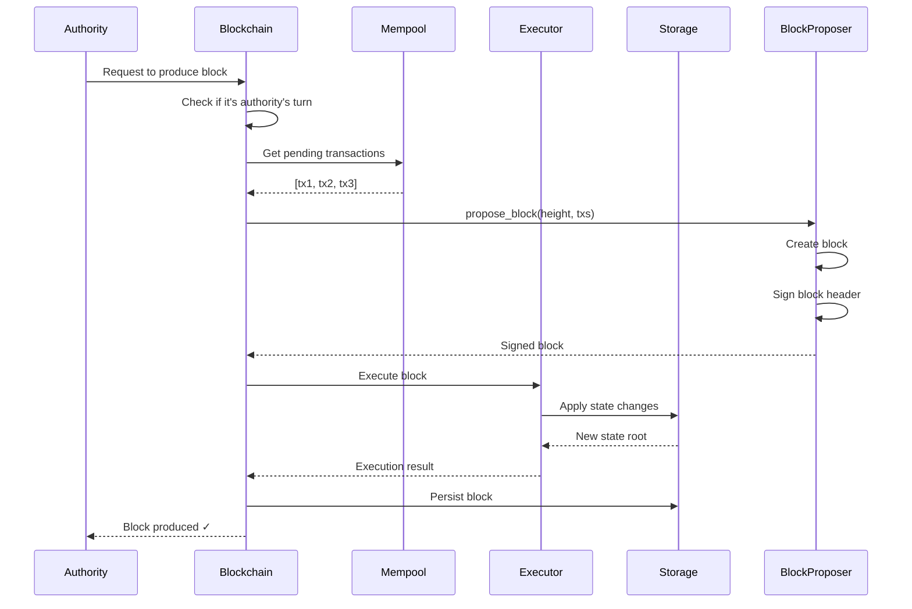

Minichain uses a **Proof of Authority (PoA)** consensus mechanism where a predetermined set of authorities take turns producing blocks in a round-robin fashion.

## Block Structure

### Block Header

Every block has a header containing metadata:

```rust
#[derive(Debug, Clone, PartialEq, Eq, Serialize, Deserialize)]
pub struct BlockHeader {
    /// Block height (0 for genesis).
    pub height: u64,
    /// Unix timestamp in seconds.
    pub timestamp: u64,
    /// Hash of the previous block.
    pub prev_hash: Hash,
    /// Merkle root of transactions.
    pub merkle_root: Hash,
    /// Root hash of the world state after applying this block.
    pub state_root: Hash,
    /// Address of the block author (PoA authority).
    pub author: Address,
    /// Difficulty (always 1 for PoA).
    pub difficulty: u64,
    /// Nonce (unused in PoA, kept for structure).
    pub nonce: u64,
}
```

**Field Descriptions:**

| Field | Type | Description |
|-------|------|-------------|
| `height` | `u64` | Block number (0 = genesis, 1 = first block, etc.) |
| `timestamp` | `u64` | Unix timestamp when block was created |
| `prev_hash` | `Hash` | Blake3 hash of parent block header |
| `merkle_root` | `Hash` | Merkle root of all transactions in block |
| `state_root` | `Hash` | Root hash of world state after applying block |
| `author` | `Address` | Address of the authority that produced this block |
| `difficulty` | `u64` | Always 1 for PoA (no mining) |
| `nonce` | `u64` | Always 0 for PoA (kept for compatibility) |

**Block Hash:**

The block hash is computed by hashing the entire header:

```rust
impl BlockHeader {
    pub fn hash(&self) -> Hash {
        let encoded = bincode::serialize(self).unwrap();
        hash(&encoded)
    }
}
```

<Note>
  The block hash only includes header fields, not the transactions. This allows light clients to verify the chain without downloading all transaction data.
</Note>

### Full Block

A complete block includes the header, transactions, and authority signature:

```rust
#[derive(Debug, Clone, PartialEq, Eq, Serialize, Deserialize)]
pub struct Block {
    /// Block header.
    pub header: BlockHeader,
    /// List of transactions in this block.
    pub transactions: Vec<Transaction>,
    /// Authority signature over the block header.
    pub signature: Signature,
}
```

**Creating a Block:**

```rust
// Create a new block
let block = Block::new(
    1,                  // height
    prev_hash,          // parent block hash
    transactions,       // transactions to include
    state_root,         // state after applying transactions
    author_address,     // authority producing this block
);

// The merkle root is computed automatically
assert_eq!(block.header.merkle_root, merkle_root(&tx_hashes));

// Sign the block
let signed_block = block.signed(&authority_keypair);
```

### Genesis Block

The first block in the chain has special properties:

```rust
let genesis = Block::genesis(authority_address);

assert_eq!(genesis.header.height, 0);
assert_eq!(genesis.header.prev_hash, Hash::ZERO);
assert_eq!(genesis.transactions.len(), 0);
assert!(genesis.is_genesis());
```

**Genesis Properties:**
- Height: 0
- Previous hash: All zeros
- No transactions
- Merkle root: All zeros
- State root: All zeros

## Merkle Trees

### Transaction Merkle Root

Blocks use merkle trees to efficiently prove transaction inclusion:

```rust
// Compute merkle root of transactions
let tx_hashes: Vec<Hash> = transactions
    .iter()
    .map(|tx| tx.hash())
    .collect();

let merkle_root = merkle_root(&tx_hashes);
```

**Merkle Tree Construction:**

```text
         Root
        /    \
      H12    H34
     /  \   /  \
    H1  H2 H3  H4
    |   |  |   |
   Tx1 Tx2 Tx3 Tx4

H1 = hash(Tx1)
H2 = hash(Tx2)
H12 = hash(H1 || H2)
Root = hash(H12 || H34)
```

**Verification:**

```rust
// Verify merkle root matches transactions
impl Block {
    pub fn verify_merkle_root(&self) -> bool {
        let tx_hashes: Vec<Hash> = self.transactions
            .iter()
            .map(|tx| tx.hash())
            .collect();
        let computed = merkle_root(&tx_hashes);
        computed == self.header.merkle_root
    }
}
```

<Tip>
  Merkle trees allow proving a transaction is in a block with only log(n) hashes, not the entire transaction list. This is essential for light clients.
</Tip>

### Empty Block Merkle Root

Blocks with no transactions have a merkle root of zero:

```rust
let empty_block = Block::new(1, prev_hash, vec![], state_root, author);
assert_eq!(empty_block.header.merkle_root, Hash::ZERO);
```

## Proof of Authority (PoA)

### Why Proof of Authority?

Minichain uses PoA instead of Proof of Work (PoW) or Proof of Stake (PoS) because:

**Advantages:**
- ✅ Simple to understand and implement
- ✅ Deterministic block production (no mining uncertainty)
- ✅ Low computational requirements (no hashing competitions)
- ✅ Fast block times (no waiting for miners)
- ✅ Energy efficient (no wasteful computation)

**Trade-offs:**
- ⚠️ Centralized (authorities are pre-selected)
- ⚠️ Requires trust in authorities
- ⚠️ Single-node in current implementation

<Note>
  PoA is ideal for private/consortium blockchains, testnets, and educational projects like Minichain. Production blockchains typically use PoW or PoS for decentralization.
</Note>

### PoA Configuration

Configure the authority set and block time:

```rust
#[derive(Debug, Clone)]
pub struct PoAConfig {
    /// List of authority addresses that can produce blocks.
    pub authorities: Vec<Address>,
    /// Block time target in seconds (e.g., 5 seconds per block).
    pub block_time: u64,
    /// Maximum allowed clock drift in seconds (e.g., 30 seconds).
    pub max_clock_drift: u64,
}

// Create configuration with 3 authorities and 5-second blocks
let config = PoAConfig::new(
    vec![authority1, authority2, authority3],
    5,  // 5-second block time
);
```

### Round-Robin Scheduling

Authorities take turns producing blocks in a deterministic order:

```rust
impl PoAConfig {
    /// Calculate which authority should produce a block at a given height.
    pub fn authority_at_height(&self, height: u64) -> Result<Address> {
        if self.authorities.is_empty() {
            return Err(ConsensusError::NoAuthorities);
        }
        let index = (height as usize) % self.authorities.len();
        Ok(self.authorities[index])
    }
}
```

**Example with 3 authorities:**

```text
Height | Authority Index | Authority
-------|----------------|----------
  0    |       0        | Authority 1
  1    |       1        | Authority 2
  2    |       2        | Authority 3
  3    |       0        | Authority 1 (wraps around)
  4    |       1        | Authority 2
  5    |       2        | Authority 3
```

<Tip>
  Round-robin scheduling ensures all authorities get equal opportunity to produce blocks. With N authorities, each authority produces every Nth block.
</Tip>

### Authority Management

The `Authority` struct manages the authority set:

```rust
pub struct Authority {
    config: PoAConfig,
    public_keys: HashMap<Address, PublicKey>,
}

impl Authority {
    pub fn new(config: PoAConfig) -> Self {
        Self {
            config,
            public_keys: HashMap::new(),
        }
    }

    /// Register a public key for signature verification
    pub fn register_public_key(&mut self, address: Address, public_key: PublicKey) {
        self.public_keys.insert(address, public_key);
    }

    /// Check if an address is an authority
    pub fn is_authority(&self, address: &Address) -> bool {
        self.config.is_authority(address)
    }
}
```

## Block Validation

### Validation Rules

Blocks must pass several validation checks:

<Steps>
  <Step title="Authority Verification">
    The block author must be an authorized validator and it must be their turn.
  </Step>
  <Step title="Signature Verification">
    The block signature must be valid for the authority's public key.
  </Step>
  <Step title="Timestamp Validation">
    Block timestamp must be after parent and not too far in the future.
  </Step>
  <Step title="Merkle Root Verification">
    The merkle root must match the hash of all transactions.
  </Step>
  <Step title="Transaction Validation">
    All transactions must be individually valid (signatures, nonces, balances).
  </Step>
</Steps>

### Authority Verification

```rust
/// Verify that a block was produced by the correct authority
pub fn verify_block_authority(&self, block: &Block) -> Result<()> {
    let author = &block.header.author;

    // Check if author is an authority
    if !self.is_authority(author) {
        return Err(ConsensusError::UnauthorizedAuthority(*author));
    }

    // Check if it's this authority's turn
    let expected = self.config.authority_at_height(block.header.height)?;
    if expected != *author {
        return Err(ConsensusError::NotTurn {
            expected,
            got: *author,
        });
    }

    Ok(())
}
```

<Warning>
  If an authority produces a block out of turn, the block is invalid even if the signature is correct. The round-robin schedule must be strictly enforced.
</Warning>

### Signature Verification

```rust
/// Verify the block signature
pub fn verify_block_signature(&self, block: &Block) -> Result<()> {
    let author = &block.header.author;
    let public_key = self.get_public_key(author)
        .ok_or(ConsensusError::UnauthorizedAuthority(*author))?;

    if !block.verify_signature(public_key) {
        return Err(ConsensusError::InvalidSignature);
    }

    Ok(())
}

// Block signature verification
impl Block {
    pub fn verify_signature(&self, public_key: &PublicKey) -> bool {
        let hash = self.header.hash();
        public_key.verify(hash.as_bytes(), &self.signature).is_ok()
    }
}
```

### Timestamp Validation

```rust
/// Verify the block timestamp is valid
pub fn verify_block_timestamp(
    &self,
    block: &Block,
    parent_timestamp: u64,
    now: u64,
) -> Result<()> {
    // Block timestamp must be after parent
    if block.header.timestamp <= parent_timestamp {
        return Err(ConsensusError::TimestampTooEarly);
    }

    // Block timestamp cannot be too far in the future
    if block.header.timestamp > now + self.config.max_clock_drift {
        return Err(ConsensusError::TimestampTooFuture);
    }

    Ok(())
}
```

**Timestamp Rules:**
- Must be greater than parent block timestamp
- Cannot be more than `max_clock_drift` seconds in the future
- Prevents timestamp manipulation attacks

### Complete Block Verification

```rust
/// Verify all consensus rules for a block
pub fn verify_block(&self, block: &Block, parent_timestamp: u64) -> Result<()> {
    let now = BlockHeader::current_timestamp();

    // Verify authority
    self.verify_block_authority(block)?;

    // Verify signature
    self.verify_block_signature(block)?;

    // Verify timestamp
    self.verify_block_timestamp(block, parent_timestamp, now)?;

    Ok(())
}
```

## Block Production

### Block Proposer

Authorities use the `BlockProposer` to create and sign blocks:

```rust
pub struct BlockProposer {
    keypair: Keypair,
    config: PoAConfig,
}

impl BlockProposer {
    pub fn new(keypair: Keypair, config: PoAConfig) -> Self {
        Self { keypair, config }
    }

    /// Check if this proposer can produce a block at the given height
    pub fn can_propose_at_height(&self, height: u64) -> Result<bool> {
        let expected = self.config.authority_at_height(height)?;
        Ok(expected == self.keypair.address())
    }
}
```

### Proposing a Block

```rust
/// Propose a new block (creates and signs it)
pub fn propose_block(
    &self,
    height: u64,
    prev_hash: Hash,
    transactions: Vec<Transaction>,
    state_root: Hash,
) -> Result<Block> {
    // Verify it's our turn
    if !self.can_propose_at_height(height)? {
        let expected = self.config.authority_at_height(height)?;
        return Err(ConsensusError::NotTurn {
            expected,
            got: self.address(),
        });
    }

    // Create and sign the block
    let block = Block::new(
        height,
        prev_hash,
        transactions,
        state_root,
        self.address(),
    ).signed(&self.keypair);

    Ok(block)
}
```

### Block Production Flow



## Real-World Examples

### Example 1: Initialize PoA Chain

```rust
// Generate 3 authority keypairs
let authority1 = Keypair::generate();
let authority2 = Keypair::generate();
let authority3 = Keypair::generate();

// Configure PoA with 3 authorities, 5-second blocks
let config = PoAConfig::new(
    vec![
        authority1.address(),
        authority2.address(),
        authority3.address(),
    ],
    5,  // 5-second block time
);

// Create authority manager
let mut authority = Authority::new(config.clone());
authority.register_public_key(authority1.address(), authority1.public_key.clone());
authority.register_public_key(authority2.address(), authority2.public_key.clone());
authority.register_public_key(authority3.address(), authority3.public_key.clone());

// Create genesis block
let genesis = Block::genesis(authority1.address()).signed(&authority1);
blockchain.init_genesis(&genesis)?;
```

### Example 2: Produce Block as Authority

```rust
// Load authority keypair
let authority_keypair = load_keypair("authority_0")?;

// Create block proposer
let proposer = BlockProposer::new(authority_keypair, config);

// Get current chain state
let height = blockchain.height() + 1;
let prev_hash = blockchain.last_block_hash();

// Check if it's our turn
if !proposer.can_propose_at_height(height)? {
    println!("Not our turn to produce block {}", height);
    return Ok(());
}

// Get pending transactions from mempool
let transactions = blockchain.select_transactions(1000)?;

// Execute transactions to get new state root
let state_root = blockchain.execute_transactions(&transactions)?;

// Propose and sign block
let block = proposer.propose_block(
    height,
    prev_hash,
    transactions,
    state_root,
)?;

// Verify and add to chain
blockchain.add_block(block)?;
println!("Block {} produced!", height);
```

### Example 3: Verify Received Block

```rust
// Receive block from network (or local production)
let block: Block = receive_block();

// Get parent block for timestamp validation
let parent = blockchain.get_block(&block.header.prev_hash)?;

// Verify all consensus rules
match authority.verify_block(&block, parent.header.timestamp) {
    Ok(()) => {
        // Verify merkle root
        if !block.verify_merkle_root() {
            return Err("Invalid merkle root");
        }
        
        // Execute and verify state root
        let result = blockchain.execute_block(&block)?;
        if result.state_root != block.header.state_root {
            return Err("State root mismatch");
        }
        
        // Add to chain
        blockchain.add_block(block)?;
        println!("Block accepted");
    }
    Err(e) => {
        println!("Block rejected: {}", e);
        return Err(e);
    }
}
```

## Block Utilities

### Block Queries

```rust
// Get block hash
let hash = block.hash();

// Get block height
let height = block.height();

// Check if genesis
if block.is_genesis() {
    println!("This is the genesis block");
}

// Count transactions
let tx_count = block.tx_count();

// Calculate total gas
let total_gas = block.total_gas_limit();
```

### Block Signing

```rust
// Sign a block
let mut block = Block::new(height, prev_hash, txs, state_root, author);
block.sign(&keypair);

// Or use builder pattern
let block = Block::new(height, prev_hash, txs, state_root, author)
    .signed(&keypair);
```

## Best Practices

<AccordionGroup>
  <Accordion title="Always verify it's the authority's turn">
    ```rust
    // ✅ Good: Check round-robin schedule
    let expected = config.authority_at_height(height)?;
    if block.header.author != expected {
        return Err(ConsensusError::NotTurn);
    }

    // ❌ Bad: Only check if author is an authority
    if !config.is_authority(&block.header.author) {
        return Err(ConsensusError::Unauthorized);
    }
    ```
  </Accordion>

  <Accordion title="Verify signatures before accepting blocks">
    ```rust
    // ✅ Good: Verify signature matches author
    let pubkey = authority.get_public_key(&block.header.author)?;
    if !block.verify_signature(pubkey) {
        return Err(ConsensusError::InvalidSignature);
    }

    // ❌ Bad: Trust block without verification
    blockchain.add_block(block)?;  // Could be forged!
    ```
  </Accordion>

  <Accordion title="Validate timestamps to prevent manipulation">
    ```rust
    // ✅ Good: Enforce timestamp constraints
    if block.header.timestamp <= parent.header.timestamp {
        return Err(ConsensusError::TimestampTooEarly);
    }
    if block.header.timestamp > now + max_clock_drift {
        return Err(ConsensusError::TimestampTooFuture);
    }

    // ❌ Bad: Accept any timestamp
    // Allows authorities to manipulate time!
    ```
  </Accordion>

  <Accordion title="Always verify merkle roots">
    ```rust
    // ✅ Good: Verify merkle root matches transactions
    if !block.verify_merkle_root() {
        return Err(ValidationError::InvalidMerkleRoot);
    }

    // ❌ Bad: Trust merkle root
    // Could claim transactions that aren't in the block!
    ```
  </Accordion>
</AccordionGroup>

## Next Steps

<CardGroup cols={2}>
  <Card title="Gas System" icon="gauge" href="/core-concepts/gas-system">
    Learn about gas metering and operation costs
  </Card>
  <Card title="Virtual Machine" icon="microchip" href="/vm/overview">
    Understand how transactions execute
  </Card>
  <Card title="Storage Layer" icon="database" href="/api/storage/database">
    Explore persistent state management
  </Card>
  <Card title="CLI Reference" icon="terminal" href="/cli/overview">
    Use the CLI to produce blocks
  </Card>
</CardGroup>
