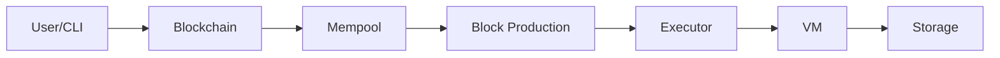

# Introduction to Minichain

Minichain is a complete, single-node, account-based blockchain built entirely in Rust. It's designed as an educational project to help developers understand blockchain internals without the complexity of production systems.

<Note>
This is a learning-focused implementation. It prioritizes clarity and completeness over optimization and production features.
</Note>

## What is Minichain?

Minichain is a fully-functional blockchain featuring:

- **Blake3 hashing** for cryptographic operations
- **Ed25519 signatures** for transaction signing
- **Register-based VM** with 16 registers and gas metering
- **Proof of Authority** consensus with round-robin block production
- **Custom assembly language** with human-readable syntax
- **Full-featured CLI** for chain interaction
- **Persistent storage** using sled embedded database
- **Merkle trees** for efficient state verification

## Key Features

<CardGroup cols={2}>
  <Card title="Account-Based Model" icon="user">
    Track accounts with balances, nonces, and contract code. Supports both externally-owned accounts (EOAs) and smart contracts.
  </Card>
  
  <Card title="Register-Based VM" icon="microchip">
    Execute smart contracts using a 16-register virtual machine with 40+ opcodes covering arithmetic, logic, memory, storage, and control flow.
  </Card>
  
  <Card title="Gas System" icon="gas-pump">
    Ethereum-inspired gas metering where storage operations cost ~100x more than arithmetic, preventing resource abuse.
  </Card>
  
  <Card title="Custom Assembly" icon="code">
    Write smart contracts in human-readable assembly with labels, directives, and comments that compile to VM bytecode.
  </Card>
  
  <Card title="PoA Consensus" icon="shield-check">
    Proof of Authority with designated validators using round-robin block production and Ed25519 signatures.
  </Card>
  
  <Card title="Persistent Storage" icon="database">
    All blockchain data persists to disk using the sled embedded database with atomic state updates.
  </Card>
</CardGroup>

## Architecture Overview

Minichain is organized into modular crates, each responsible for a specific layer of the blockchain:

```
minichain/
├── crates/
│   ├── core/        # Primitives: hash, crypto, accounts, blocks, transactions
│   ├── storage/     # Persistent state layer (sled)
│   ├── vm/          # Register-based virtual machine with gas metering
│   ├── assembler/   # Assembly language → bytecode compiler
│   ├── consensus/   # Proof of Authority validation and block proposing
│   ├── chain/       # Blockchain orchestration (mempool, executor, validation)
│   └── cli/         # Command-line interface
├── docs/            # Documentation
└── tests/           # Integration tests
```

### Transaction Flow

The lifecycle of a transaction in Minichain:



1. **CLI**: User creates and signs transaction with Ed25519
2. **Blockchain**: Validates signature and submits to mempool
3. **Mempool**: Orders transactions by gas price (highest first)
4. **Block Production**: Authority collects transactions for new block
5. **Executor**: Executes each transaction in the VM
6. **VM**: Runs bytecode with gas metering and register operations
7. **Storage**: Persists state changes atomically to sled database

## Core Components

### Accounts & Balances

Minichain uses an account-based model similar to Ethereum:

- **Balance**: Token amount held by the account
- **Nonce**: Transaction counter to prevent replay attacks
- **Code Hash**: Reference to deployed contract bytecode (contracts only)
- **Storage Root**: Merkle root of contract storage (contracts only)

### Transactions

Three transaction types are supported:

- **Transfer**: Send tokens between accounts
- **Deploy**: Deploy new smart contract bytecode
- **Call**: Execute existing smart contract

All transactions include gas limits and gas prices for resource metering.

### Virtual Machine

The VM is register-based (not stack-based like EVM) with:

- **16 general-purpose registers** (R0-R15) holding 64-bit values
- **40+ opcodes** including:
  - Arithmetic: `ADD`, `SUB`, `MUL`, `DIV`, `MOD`
  - Logic: `AND`, `OR`, `XOR`, `NOT`, `SHL`, `SHR`
  - Comparison: `EQ`, `LT`, `GT`, `LE`, `GE`
  - Memory: `LOAD8`, `LOAD64`, `STORE8`, `STORE64`
  - Storage: `SLOAD`, `SSTORE`
  - Control: `JUMP`, `JUMPI`, `CALL`, `RET`, `HALT`
  - Context: `CALLER`, `CALLVALUE`, `ADDRESS`, `BLOCKNUMBER`, `TIMESTAMP`

### Gas Metering

Gas costs are designed to reflect real computational and storage costs:

| Operation | Gas Cost | Notes |
|-----------|----------|-------|
| `ADD`, `SUB`, `MOV` | 2 | Basic register operations |
| `MUL` | 3 | Multiplication |
| `DIV`, `MOD` | 5 | Division operations |
| `LOAD64`, `STORE64` | 3 | Memory read/write |
| `SLOAD` | 100 | Storage read (expensive) |
| `SSTORE` | 5,000-20,000 | Storage write (very expensive) |
| `JUMP`, `JUMPI` | 8 | Control flow |

Storage operations are intentionally expensive (100x arithmetic) to discourage abuse and reflect the real cost of disk I/O.

### Assembly Language

Write contracts in readable assembly that compiles to bytecode:

```asm
.entry main

main:
    LOADI R0, 0          ; storage slot 0 = counter
    SLOAD R1, R0         ; load current value
    LOADI R2, 1
    ADD R1, R1, R2       ; increment
    SSTORE R0, R1        ; save back
    HALT
```

Features:
- Labels for jump targets
- Comments with semicolons
- `.entry` directive to mark entry points
- Immediate values with `LOADI`
- All VM opcodes supported

### Block Production (PoA)

Proof of Authority consensus with simple round-robin:

- Authority selection: `height % authority_count`
- Only designated authority can produce each block
- Authorities sign blocks with Ed25519
- Timestamp validation with configurable clock drift
- Automatic transaction inclusion from mempool

## Why Minichain?

Minichain was built to answer the question: **"How does a blockchain really work?"**

By implementing every component from scratch, you can:

- ✅ See how transactions are validated and executed
- ✅ Understand how state is managed and persisted
- ✅ Learn how consensus mechanisms coordinate block production
- ✅ Explore how virtual machines execute smart contracts
- ✅ Study how gas metering prevents resource abuse
- ✅ Practice building modular Rust architectures

<Warning>
Minichain is **not** production-ready. It's a single-node blockchain without networking, designed purely for educational purposes.
</Warning>

## What's Next?

Ready to get started? Here's your path:

<Steps>
  <Step title="Install Rust">
    Install Rust 1.70+ from [rust-lang.org](https://rust-lang.org/tools/install/)
  </Step>
  
  <Step title="Build Minichain">
    Follow the [Installation](/installation) guide to build from source
  </Step>
  
  <Step title="Run the Quickstart">
    Complete the [Quickstart](/quickstart) to initialize a chain, deploy a contract, and produce blocks
  </Step>
</Steps>

## Project Status

✅ **Complete Implementation**

- [x] Core primitives (hash, crypto, accounts, transactions, blocks, merkle)
- [x] Storage layer (persistent state with sled)
- [x] Virtual machine (register-based VM with gas metering)
- [x] Assembler (assembly → bytecode compiler)
- [x] Consensus & chain (PoA, mempool, executor, validation)
- [x] CLI (complete command-line interface)
- [x] Documentation (comprehensive guides)
- [x] Tests (26+ passing tests)
- [x] Code quality (0 clippy warnings)

Minichain is feature-complete and ready for educational use!