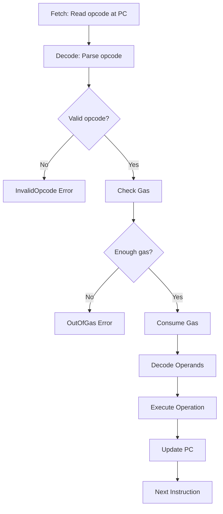

The Minichain VM executes bytecode using a **fetch-decode-execute cycle** with gas metering and error handling.

## Execution Context

Every VM execution has a complete execution context:

### VM State Structure

From `crates/vm/src/executor.rs:44`:

```rust
pub struct Vm {
    // Core execution state
    registers: Registers,        // 16 x 64-bit registers
    memory: Memory,              // Linear RAM (max 1MB)
    pc: usize,                   // Program counter
    gas: GasMeter,               // Gas tracking
    bytecode: Vec<u8>,           // Executable code
    halted: bool,                // Execution state
    
    // Blockchain context
    caller: Address,             // Transaction sender
    address: Address,            // Contract address
    call_value: u64,             // Value sent with call
    block_number: u64,           // Current block height
    timestamp: u64,              // Block timestamp
    
    // External interfaces
    storage: Option<Box<dyn StorageBackend>>,
    logs: Vec<u64>,              // Debug output
}
```

<CardGroup cols={3}>
  <Card title="Registers" icon="microchip">
    R0-R15 general-purpose 64-bit registers
  </Card>
  <Card title="Memory" icon="memory">
    1MB linear byte-addressable RAM
  </Card>
  <Card title="Program Counter" icon="location-arrow">
    Points to current instruction
  </Card>
  <Card title="Gas Meter" icon="gauge">
    Tracks remaining execution budget
  </Card>
  <Card title="Storage" icon="database">
    Persistent key-value state
  </Card>
  <Card title="Context" icon="info-circle">
    Caller, value, block info
  </Card>
</CardGroup>

## Creating a VM Instance

### Basic Constructor

```rust
use minichain_vm::Vm;
use minichain_core::Address;

let vm = Vm::new(
    bytecode,           // Vec<u8>: Executable bytecode
    1_000_000,          // u64: Gas limit
    caller_address,     // Address: Who initiated the call
    contract_address,   // Address: This contract's address
    0,                  // u64: Value sent (in smallest unit)
);
```

### With Full Context

```rust
let vm = Vm::new_with_context(
    bytecode,
    1_000_000,          // gas limit
    caller_address,
    contract_address,
    100,                // call value
    12345,              // block number
    1699900000,         // timestamp (Unix epoch)
);
```

### With Storage Backend

```rust
let mut vm = Vm::new(...);

// Attach a storage backend
let storage = MyStorageBackend::new();
vm.set_storage(Box::new(storage));

// Or set block context later
vm.set_block_context(block_number, timestamp);
```

## Execution Loop

The main execution loop runs until the program halts or encounters an error.

### Main Run Loop

From `crates/vm/src/executor.rs:141`:

```rust
pub fn run(&mut self) -> Result<ExecutionResult, VmError> {
    while !self.halted && self.pc < self.bytecode.len() {
        self.step()?;  // Execute one instruction
    }
    
    Ok(ExecutionResult {
        success: self.halted,
        gas_used: self.gas.used(),
        return_data: Vec::new(),
        logs: std::mem::take(&mut self.logs),
    })
}
```

**Execution continues while**:
- `!self.halted`: HALT/RET/REVERT hasn't been executed
- `self.pc < self.bytecode.len()`: Program counter is within bounds

<Note>
Running off the end of bytecode (PC >= bytecode length) results in `success: false`.
</Note>

### Fetch-Decode-Execute Cycle

From `crates/vm/src/executor.rs:155`:

```rust
fn step(&mut self) -> Result<(), VmError> {
    // 1. FETCH: Read opcode byte
    let opcode_byte = self.bytecode[self.pc];
    let opcode = Opcode::from_byte(opcode_byte)
        .ok_or(VmError::InvalidOpcode(opcode_byte))?;
    
    // 2. DECODE & EXECUTE: Match on opcode
    match opcode {
        Opcode::ADD => {
            // 2a. Check gas
            self.gas.consume(GasCosts::BASE)?;
            
            // 2b. Decode operands
            let (dst, s1, s2) = self.decode_rrr();
            
            // 2c. Execute operation
            let result = self.registers.get(s1)
                .wrapping_add(self.registers.get(s2));
            self.registers.set(dst, result);
            
            // 2d. Update program counter
            self.pc += 3;
        }
        // ... other opcodes ...
    }
    
    Ok(())
}
```



## Instruction Decoding

Operand formats vary by opcode:

### Single Register (R)

From `crates/vm/src/executor.rs:520`:

```rust
/// Decode: [opcode, RRRR____]
fn decode_r(&self) -> usize {
    ((self.bytecode[self.pc + 1] >> 4) & 0x0F) as usize
}
```

**Example**: `JUMP R5`
```
Byte 0: 0x02 (JUMP opcode)
Byte 1: 0x50 (R5 in upper nibble)
```

### Two Registers (RR)

From `crates/vm/src/executor.rs:525`:

```rust
/// Decode: [opcode, RRRR_SSSS]
fn decode_rr(&self) -> (usize, usize) {
    let byte = self.bytecode[self.pc + 1];
    let r1 = ((byte >> 4) & 0x0F) as usize;
    let r2 = (byte & 0x0F) as usize;
    (r1, r2)
}
```

**Example**: `MOV R3, R7`
```
Byte 0: 0x71 (MOV opcode)
Byte 1: 0x37 (R3 in upper, R7 in lower)
```

### Three Registers (RRR)

From `crates/vm/src/executor.rs:533`:

```rust
/// Decode: [opcode, DDDD_SSS1, SSS2____]
fn decode_rrr(&self) -> (usize, usize, usize) {
    let b1 = self.bytecode[self.pc + 1];
    let b2 = self.bytecode[self.pc + 2];
    let dst = ((b1 >> 4) & 0x0F) as usize;
    let s1 = (b1 & 0x0F) as usize;
    let s2 = ((b2 >> 4) & 0x0F) as usize;
    (dst, s1, s2)
}
```

**Example**: `ADD R2, R5, R9`
```
Byte 0: 0x10 (ADD opcode)
Byte 1: 0x25 (R2 dest, R5 src1)
Byte 2: 0x90 (R9 src2)
```

### 64-bit Immediate

From `crates/vm/src/executor.rs:543`:

```rust
/// Decode 64-bit little-endian immediate
fn decode_imm64(&self) -> u64 {
    let start = self.pc + 2;
    let bytes = &self.bytecode[start..start + 8];
    u64::from_le_bytes(bytes.try_into().unwrap())
}
```

**Example**: `LOADI R0, 0x123456789ABCDEF0`
```
Byte 0: 0x70 (LOADI opcode)
Byte 1: 0x00 (R0 register)
Bytes 2-9: 0xF0 0xDE 0xBC 0x9A 0x78 0x56 0x34 0x12 (little-endian)
```

## Execution States

The VM can be in several states:

<Tabs>
  <Tab title="Running">
    **State**: `halted = false`, `pc < bytecode.len()`
    
    Normal execution:
    ```rust
    while !self.halted && self.pc < self.bytecode.len() {
        self.step()?;
    }
    ```
    
    The VM continues fetching and executing instructions.
  </Tab>
  
  <Tab title="Halted (Success)">
    **Caused by**: HALT or RET opcode
    
    From `crates/vm/src/executor.rs:162`:
    ```rust
    Opcode::HALT => {
        self.gas.consume(GasCosts::ZERO)?;
        self.halted = true;
    }
    ```
    
    Result:
    ```rust
    ExecutionResult {
        success: true,
        gas_used: ...,
        return_data: vec![],
        logs: ...,
    }
    ```
  </Tab>
  
  <Tab title="Reverted">
    **Caused by**: REVERT opcode
    
    From `crates/vm/src/executor.rs:387`:
    ```rust
    Opcode::REVERT => {
        self.gas.consume(GasCosts::ZERO)?;
        self.halted = true;
        self.pc += 1;
        return Err(VmError::Reverted);
    }
    ```
    
    Result: `Err(VmError::Reverted)`
    
    State changes are **rolled back** by the caller.
  </Tab>
  
  <Tab title="Out of Gas">
    **Caused by**: Insufficient gas for operation
    
    ```rust
    if self.remaining < amount {
        return Err(VmError::OutOfGas {
            required: amount,
            remaining: self.remaining,
        });
    }
    ```
    
    Execution stops immediately. No state changes are committed.
  </Tab>
  
  <Tab title="Error">
    **Caused by**: Runtime errors
    
    - `InvalidOpcode`: Unknown byte
    - `DivisionByZero`: DIV/MOD by 0
    - `MemoryOverflow`: Access beyond 1MB
    - `InvalidJump`: Jump outside bytecode
    
    All state changes are rolled back.
  </Tab>
</Tabs>

## Error Handling

### VM Error Types

From `crates/vm/src/executor.rs:12`:

```rust
#[derive(Error, Debug, Clone, PartialEq, Eq)]
pub enum VmError {
    #[error("Out of gas: required {required}, remaining {remaining}")]
    OutOfGas { required: u64, remaining: u64 },
    
    #[error("Invalid opcode: 0x{0:02X}")]
    InvalidOpcode(u8),
    
    #[error("Division by zero")]
    DivisionByZero,
    
    #[error("Memory overflow")]
    MemoryOverflow,
    
    #[error("Invalid jump destination: {0}")]
    InvalidJump(usize),
    
    #[error("Stack underflow")]
    StackUnderflow,
    
    #[error("Execution reverted")]
    Reverted,
}
```

### Error Examples

<Accordion title="OutOfGas">
```rust
let mut vm = Vm::new(bytecode, 1, ...);
let result = vm.run();

assert!(matches!(result, Err(VmError::OutOfGas { .. })));
```
</Accordion>

<Accordion title="DivisionByZero">
```rust
let bytecode = vec![
    0x70, 0x00, 0x0A, 0x00, 0x00, 0x00, 0x00, 0x00, 0x00, 0x00,  // LOADI R0, 10
    0x70, 0x10, 0x00, 0x00, 0x00, 0x00, 0x00, 0x00, 0x00, 0x00,  // LOADI R1, 0
    0x13, 0x20, 0x10,                                            // DIV R2, R0, R1
    0x00,                                                        // HALT
];

let mut vm = Vm::new(bytecode, 1_000_000, ...);
let result = vm.run();

assert!(matches!(result, Err(VmError::DivisionByZero)));
```
</Accordion>

<Accordion title="InvalidJump">
```rust
let bytecode = vec![
    0x70, 0x00, 0xFF, 0xFF, 0x00, 0x00, 0x00, 0x00, 0x00, 0x00,  // LOADI R0, 0xFFFF
    0x02, 0x00,                                                  // JUMP R0
    0x00,                                                        // HALT
];

let mut vm = Vm::new(bytecode, 1_000_000, ...);
let result = vm.run();

assert!(matches!(result, Err(VmError::InvalidJump(0xFFFF))));
```
</Accordion>

## Storage Backend Interface

The VM uses a trait for storage abstraction:

### Storage Trait

From `crates/vm/src/executor.rs:558`:

```rust
pub trait StorageBackend {
    /// Read 32 bytes from storage slot
    fn sload(&self, key: &[u8; 32]) -> [u8; 32];
    
    /// Write 32 bytes to storage slot
    fn sstore(&mut self, key: &[u8; 32], value: &[u8; 32]);
}
```

### SLOAD Implementation

From `crates/vm/src/executor.rs:568`:

```rust
fn execute_sload(&mut self) -> Result<(), VmError> {
    // Consume gas first
    self.gas.consume(GasCosts::SLOAD)?;
    
    // Decode operands
    let (dst, key_reg) = self.decode_rr();
    
    // Convert register value to 32-byte key
    let key_value = self.registers.get(key_reg);
    let mut key = [0u8; 32];
    key[24..32].copy_from_slice(&key_value.to_be_bytes());
    
    // Read from storage (or return zeros if no backend)
    let value = if let Some(storage) = &self.storage {
        storage.sload(&key)
    } else {
        [0u8; 32]
    };
    
    // Extract lower 64 bits and store in register
    self.registers.set(dst,
        u64::from_be_bytes(value[24..32].try_into().unwrap()));
    
    self.pc += 2;
    Ok(())
}
```

### SSTORE Implementation

From `crates/vm/src/executor.rs:591`:

```rust
fn execute_sstore_internal(&mut self) -> Result<(), VmError> {
    let (key_reg, value_reg) = self.decode_rr();
    
    // Build 32-byte key
    let key_value = self.registers.get(key_reg);
    let mut key = [0u8; 32];
    key[24..32].copy_from_slice(&key_value.to_be_bytes());
    
    // Determine gas cost (depends on current storage state)
    let cost = if let Some(storage) = &self.storage {
        let current = storage.sload(&key);
        let is_empty = current == [0u8; 32];
        if is_empty {
            GasCosts::SSTORE_SET     // 20,000 gas
        } else {
            GasCosts::SSTORE_RESET   // 5,000 gas
        }
    } else {
        GasCosts::SSTORE_SET
    };
    self.gas.consume(cost)?;
    
    // Build 32-byte value
    let mut value = [0u8; 32];
    value[24..32].copy_from_slice(
        &self.registers.get(value_reg).to_be_bytes());
    
    // Write to storage
    if let Some(storage) = &mut self.storage {
        storage.sstore(&key, &value);
    }
    
    self.pc += 2;
    Ok(())
}
```

## Execution Result

From `crates/vm/src/executor.rs:36`:

```rust
pub struct ExecutionResult {
    pub success: bool,        // true if HALT/RET, false otherwise
    pub gas_used: u64,        // Total gas consumed
    pub return_data: Vec<u8>, // Return value (TODO: not yet implemented)
    pub logs: Vec<u64>,       // LOG outputs
}
```

### Example: Successful Execution

```rust
let mut vm = Vm::new(bytecode, 1_000_000, ...);
let result = vm.run().unwrap();

assert!(result.success);
assert_eq!(result.gas_used, 8);
assert_eq!(result.logs, vec![30]);
```

### Example: Failed Execution

```rust
let mut vm = Vm::new(bytecode, 1_000_000, ...);
let result = vm.run();

match result {
    Ok(exec) => {
        println!("Success: {}", exec.success);
        println!("Gas used: {}", exec.gas_used);
    }
    Err(VmError::Reverted) => {
        println!("Transaction reverted");
    }
    Err(e) => {
        println!("Error: {}", e);
    }
}
```

## Debugging and Tracing

The VM includes a tracer for debugging:

From `crates/vm/src/tracer.rs:6`:

```rust
pub struct TraceStep {
    pub pc: usize,           // Program counter
    pub opcode: Opcode,      // Executed opcode
    pub gas_before: u64,     // Gas before execution
    pub gas_after: u64,      // Gas after execution
    pub registers: [u64; 16],// Register state
}

pub struct Tracer {
    steps: Vec<TraceStep>,
    enabled: bool,
}
```

**Example trace output**:

```
   0: PC=0000 LOADI gas=999998 R0=10 R1=0 R2=0
   1: PC=000A LOADI gas=999996 R0=10 R1=20 R2=0
   2: PC=0014 ADD gas=999994 R0=10 R1=20 R2=30
   3: PC=0017 LOG gas=999992 R0=10 R1=20 R2=30
   4: PC=0019 HALT gas=999992 R0=10 R1=20 R2=30
```

## Example: Complete Execution Flow

```rust
use minichain_vm::{Vm, ExecutionResult, VmError};
use minichain_core::Address;

// Program: Add 10 + 20
let bytecode = vec![
    0x70, 0x00, 0x0A, 0x00, 0x00, 0x00, 0x00, 0x00, 0x00, 0x00,  // LOADI R0, 10
    0x70, 0x10, 0x14, 0x00, 0x00, 0x00, 0x00, 0x00, 0x00, 0x00,  // LOADI R1, 20
    0x10, 0x20, 0x10,                                            // ADD R2, R0, R1
    0xF0, 0x20,                                                  // LOG R2
    0x00,                                                        // HALT
];

let mut vm = Vm::new(
    bytecode,
    1_000_000,
    Address::ZERO,
    Address::ZERO,
    0,
);

match vm.run() {
    Ok(result) => {
        assert!(result.success);
        assert_eq!(result.logs, vec![30]);
        println!("Gas used: {}", result.gas_used);
    }
    Err(e) => {
        eprintln!("Execution failed: {}", e);
    }
}
```

## Next Steps

<CardGroup cols={2}>
  <Card title="Opcodes" icon="list" href="/vm/opcodes">
    Complete opcode reference
  </Card>
  <Card title="Gas Metering" icon="gauge" href="/vm/gas-metering">
    Understand gas consumption
  </Card>
</CardGroup>