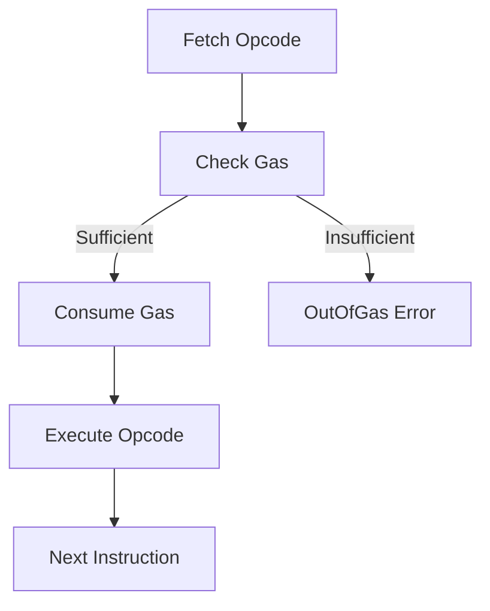

The Minichain VM uses **gas metering** to limit execution time and prevent denial-of-service attacks. Every operation consumes gas, and execution halts when gas is exhausted.

## Why Gas?

<CardGroup cols={2}>
  <Card title="Prevent Infinite Loops" icon="infinity">
    Ensure all programs eventually terminate
  </Card>
  <Card title="Fair Resource Usage" icon="scale-balanced">
    Charge users proportionally to computation
  </Card>
  <Card title="Discourage State Bloat" icon="database">
    Make storage expensive to limit blockchain size
  </Card>
  <Card title="DoS Protection" icon="shield">
    Prevent attackers from overwhelming the network
  </Card>
</CardGroup>

## Gas Model

From `crates/vm/src/gas.rs:6`:

```rust
pub struct GasCosts;

impl GasCosts {
    // Tier 1: Very cheap (simple register operations)
    pub const ZERO: u64 = 0;    // HALT, NOP
    pub const BASE: u64 = 2;    // ADD, SUB, AND, OR, MOV
    
    // Tier 2: Cheap (more complex ALU operations)
    pub const LOW: u64 = 3;     // MUL, comparison ops
    
    // Tier 3: Medium (division, shifts)
    pub const MID: u64 = 5;     // DIV, MOD, SHL, SHR
    
    // Tier 4: Memory operations
    pub const MEMORY_READ: u64 = 3;
    pub const MEMORY_WRITE: u64 = 3;
    pub const MEMORY_GROW_PER_BYTE: u64 = 1;
    
    // Tier 5: Storage (expensive!)
    pub const SLOAD: u64 = 100;          // Read from storage
    pub const SSTORE_SET: u64 = 20000;   // Write to empty slot
    pub const SSTORE_RESET: u64 = 5000;  // Overwrite existing slot
    
    // Control flow
    pub const JUMP: u64 = 8;
    pub const CALL: u64 = 700;
}
```

## Gas Tiers

### Tier 1: Zero Gas (0 gas)

Operations that don't consume resources:

| Opcode | Gas | Reason |
|--------|-----|--------|
| HALT   | 0   | Program termination |
| NOP    | 0   | No operation |
| RET    | 0   | Return from function |
| REVERT | 0   | Error return |

### Tier 2: Base Cost (2 gas)

Simple register operations:

| Category | Opcodes | Gas |
|----------|---------|-----|
| Arithmetic | ADD, SUB, ADDI | 2 |
| Bitwise | AND, OR, XOR, NOT | 2 |
| Comparison | EQ, NE, LT, GT, LE, GE, ISZERO | 2 |
| Data Movement | MOV, LOADI | 2 |
| Context | CALLER, CALLVALUE, ADDRESS, BLOCKNUMBER, TIMESTAMP, GAS | 2 |
| Debug | LOG | 2 |

<Note>
These operations are very cheap because they only touch registers, not memory or storage.
</Note>

### Tier 3: Low Cost (3 gas)

More complex arithmetic:

| Category | Opcodes | Gas |
|----------|---------|-----|
| Arithmetic | MUL | 3 |
| Memory | LOAD8, LOAD64, STORE8, STORE64, MCOPY | 3 |

### Tier 4: Medium Cost (5 gas)

Expensive CPU operations:

| Category | Opcodes | Gas | Reason |
|----------|---------|-----|--------|
| Arithmetic | DIV, MOD | 5 | Division is expensive in hardware |
| Bitwise | SHL, SHR | 5 | Shifts can be multi-cycle |

### Tier 5: Control Flow (8-700 gas)

| Opcode | Gas | Reason |
|--------|-----|--------|
| JUMP   | 8   | Branch prediction penalty |
| JUMPI  | 8   | Conditional branch penalty |
| CALL   | 700 | Cross-contract call overhead |

### Tier 6: Storage (100-20,000 gas)

<Warning>
Storage is **intentionally expensive** to prevent blockchain bloat.
</Warning>

| Operation | Scenario | Gas | Reason |
|-----------|----------|-----|--------|
| SLOAD | Always | 100 | Disk I/O + Merkle proof |
| SSTORE | New slot (0 → non-zero) | 20,000 | Permanent state expansion |
| SSTORE | Update (non-zero → non-zero) | 5,000 | Modify existing state |
| SSTORE | Delete (non-zero → 0) | 5,000 | Freeing storage |

## Gas Metering Implementation

### Gas Meter Structure

From `crates/vm/src/gas.rs:35`:

```rust
pub struct GasMeter {
    remaining: u64,  // Gas left for execution
    used: u64,       // Total gas consumed
}

impl GasMeter {
    pub fn new(limit: u64) -> Self {
        Self {
            remaining: limit,
            used: 0,
        }
    }
    
    pub fn consume(&mut self, amount: u64) -> Result<(), VmError> {
        if self.remaining < amount {
            return Err(VmError::OutOfGas {
                required: amount,
                remaining: self.remaining,
            });
        }
        self.remaining -= amount;
        self.used += amount;
        Ok(())
    }
}
```

### Gas Consumption Flow



### Example: Gas Tracking

From `crates/vm/src/executor.rs:172`:

```rust
Opcode::ADD => {
    self.gas.consume(GasCosts::BASE)?;  // Consume 2 gas
    let (dst, s1, s2) = self.decode_rrr();
    let result = self.registers.get(s1)
        .wrapping_add(self.registers.get(s2));
    self.registers.set(dst, result);
    self.pc += 3;
}
```

Every opcode implementation:
1. **Consumes gas first** (fails fast on OutOfGas)
2. Executes the operation
3. Updates program counter

## Storage Gas Details

### Why Storage Is Expensive

Storage operations are 100-20,000× more expensive than register operations:

<Tabs>
  <Tab title="Technical Reasons">
    - **Persistent**: Data must survive node restarts
    - **Replicated**: Every full node stores a copy
    - **Merkle Proofs**: Cryptographic integrity checks
    - **Disk I/O**: Slower than RAM by 1000×
    - **Forever**: Data never expires
  </Tab>
  
  <Tab title="Economic Reasons">
    - **State Bloat**: Unlimited free storage would grow forever
    - **Node Costs**: Validators must store all state
    - **Spam Prevention**: Expensive storage deters abuse
    - **Resource Allocation**: Users pay for what they use
  </Tab>
</Tabs>

### Dynamic Storage Pricing

From `crates/vm/src/executor.rs:591`:

```rust
fn execute_sstore_internal(&mut self) -> Result<(), VmError> {
    let (key_reg, value_reg) = self.decode_rr();
    
    // Determine gas cost based on current storage state
    let cost = if let Some(storage) = &self.storage {
        let current = storage.sload(&key);
        let is_empty = current == [0u8; 32];
        
        if is_empty {
            GasCosts::SSTORE_SET     // 20,000 gas (new slot)
        } else {
            GasCosts::SSTORE_RESET   // 5,000 gas (update)
        }
    } else {
        GasCosts::SSTORE_SET
    };
    
    self.gas.consume(cost)?;  // Consume before writing
    
    // ... perform the write ...
}
```

<Note>
The VM checks if the slot is empty **before** consuming gas, so the correct amount is charged.
</Note>

## Memory Gas

Memory expansion costs gas:

```rust
pub fn memory_expansion_cost(current_size: usize, new_size: usize) -> u64 {
    if new_size <= current_size {
        return 0;  // No expansion
    }
    let expansion = (new_size - current_size) as u64;
    expansion * GasCosts::MEMORY_GROW_PER_BYTE  // 1 gas per byte
}
```

**Example**: Growing memory from 100 to 200 bytes costs 100 gas.

## Gas Estimation Examples

### Example 1: Simple Arithmetic

```rust
LOADI R0, 10    // 2 gas
LOADI R1, 20    // 2 gas
ADD R2, R0, R1  // 2 gas
LOG R2          // 2 gas
HALT            // 0 gas
// Total: 8 gas
```

### Example 2: Memory Operations

```rust
LOADI R0, 0x1000      // 2 gas
LOADI R1, 42          // 2 gas
STORE64 [R0], R1      // 3 gas + expansion
LOAD64 R2, [R0]       // 3 gas
HALT                  // 0 gas
// Total: 10 gas + memory expansion
```

Memory expansion:
- Address 0x1000 = 4096 bytes
- Expansion from 0 to 4104 bytes = 4104 gas
- **Total: 10 + 4104 = 4114 gas**

### Example 3: Storage Operations

```rust
LOADI R0, 5           // 2 gas
LOADI R1, 100         // 2 gas
SSTORE R0, R1         // 20,000 gas (new slot)
SLOAD R2, R0          // 100 gas
HALT                  // 0 gas
// Total: 20,104 gas
```

Subsequent update:
```rust
LOADI R0, 5           // 2 gas
LOADI R1, 200         // 2 gas
SSTORE R0, R1         // 5,000 gas (update existing)
HALT                  // 0 gas
// Total: 5,004 gas
```

### Example 4: Loop with 100 Iterations

```rust
LOADI R0, 100         // 2 gas (counter)
LOADI R1, 0           // 2 gas (sum)
LOADI R2, 1           // 2 gas (constant)
LOADI R3, loop_addr   // 2 gas
LOADI R4, end_addr    // 2 gas

loop:
  ADD R1, R1, R0      // 2 gas × 100
  SUB R0, R0, R2      // 2 gas × 100
  ISZERO R5, R0       // 2 gas × 100
  JUMPI R5, R4        // 8 gas × 100 (1x to end, 99x not taken)
  JUMP R3             // 8 gas × 99
  
end:
  HALT                // 0 gas

// Setup: 10 gas
// Loop body: (2 + 2 + 2 + 8 + 8) × 99 = 2,178 gas
// Final iteration: (2 + 2 + 2 + 8) = 14 gas
// Total: 10 + 2,178 + 14 = 2,202 gas
```

## Out of Gas Errors

When gas is exhausted:

```rust
pub enum VmError {
    OutOfGas {
        required: u64,   // How much gas was needed
        remaining: u64,  // How much gas was left
    },
    // ...
}
```

**Example**:

```rust
let mut vm = Vm::new(bytecode, 1, ...);  // Only 1 gas
let result = vm.run();

// LOADI costs 2 gas, but only 1 is available
assert!(matches!(result, Err(VmError::OutOfGas {
    required: 2,
    remaining: 1,
})));
```

From the test at `crates/vm/tests/vm_test.rs:136`:

```rust
#[test]
fn test_out_of_gas() {
    let bytecode = vec![
        0x70, 0x00, 0x01, 0x00, 0x00, 0x00, 0x00, 0x00, 0x00, 0x00,
        0x00,
    ];
    
    // Gas limit of 1 is not enough for LOADI (costs 2)
    let mut vm = Vm::new(bytecode, 1, Address::ZERO, Address::ZERO, 0);
    let result = vm.run();
    
    assert!(result.is_err());
}
```

## Gas Optimization Tips

<AccordionGroup>
  <Accordion title="Use Registers Instead of Memory">
    Registers are free; memory costs gas:
    
    ```rust
    // Bad: Store in memory (3 gas + expansion)
    LOADI R0, 0x100
    LOADI R1, 42
    STORE64 [R0], R1
    
    // Good: Keep in register (0 gas)
    LOADI R1, 42
    ```
  </Accordion>
  
  <Accordion title="Minimize Storage Writes">
    Storage is 10,000× more expensive than memory:
    
    ```rust
    // Bad: Write storage in loop (20,000+ gas per iteration)
    for i in 0..100 {
        SSTORE key, value
    }
    
    // Good: Accumulate in registers, write once
    for i in 0..100 {
        ADD R0, R0, R1  // 2 gas per iteration
    }
    SSTORE key, R0      // 20,000 gas once
    ```
  </Accordion>
  
  <Accordion title="Batch Operations">
    Combine operations to reduce opcode overhead:
    
    ```rust
    // Bad: Multiple small additions (6 gas)
    ADDI R0, R0, 1
    ADDI R0, R0, 1
    ADDI R0, R0, 1
    
    // Good: Single larger addition (2 gas)
    ADDI R0, R0, 3
    ```
  </Accordion>
  
  <Accordion title="Use ADDI Instead of LOADI + ADD">
    Immediate arithmetic is more efficient:
    
    ```rust
    // Bad: Load constant and add (4 gas, 12 bytes)
    LOADI R1, 10
    ADD R0, R0, R1
    
    // Good: Add immediate (2 gas, 6 bytes)
    ADDI R0, R0, 10
    ```
  </Accordion>
  
  <Accordion title="Reuse Storage Reads">
    Cache storage values in registers:
    
    ```rust
    // Bad: Read storage multiple times (300 gas)
    SLOAD R0, key
    LOG R0
    SLOAD R0, key
    LOG R0
    SLOAD R0, key
    LOG R0
    
    // Good: Read once, reuse (104 gas)
    SLOAD R0, key
    LOG R0
    LOG R0
    LOG R0
    ```
  </Accordion>
</AccordionGroup>

## Gas Refunds

<Note>
Minichain VM does **not currently implement gas refunds** for storage deletions, unlike Ethereum. This may be added in future versions.
</Note>

## Execution Result

From `crates/vm/src/executor.rs:36`:

```rust
pub struct ExecutionResult {
    pub success: bool,
    pub gas_used: u64,       // Total gas consumed
    pub return_data: Vec<u8>,
    pub logs: Vec<u64>,
}
```

The `gas_used` field shows exactly how much gas was consumed:

```rust
let result = vm.run()?;
println!("Gas used: {}", result.gas_used);
println!("Gas remaining: {}", vm.gas_remaining());
```

## Next Steps

<CardGroup cols={2}>
  <Card title="Opcodes" icon="list" href="/vm/opcodes">
    See gas costs for each opcode
  </Card>
  <Card title="Execution Model" icon="play" href="/vm/execution-model">
    Learn how gas is checked during execution
  </Card>
</CardGroup>